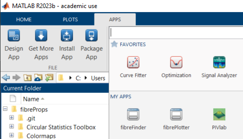
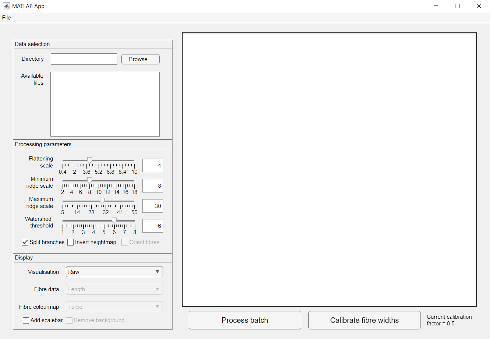
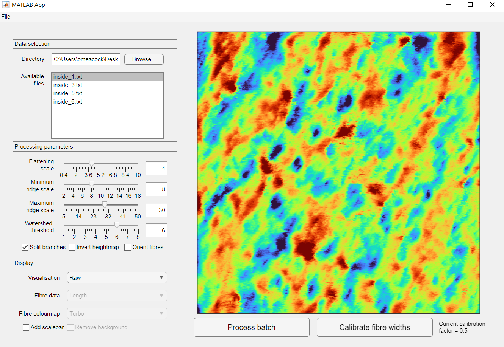
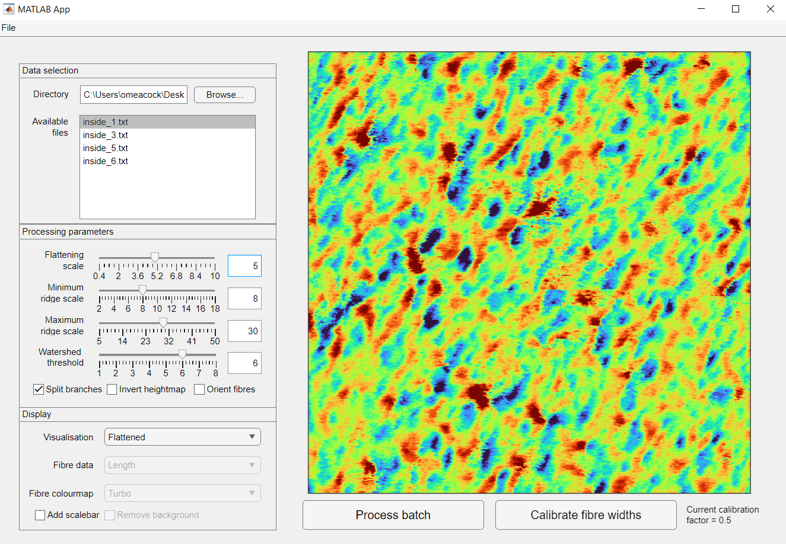
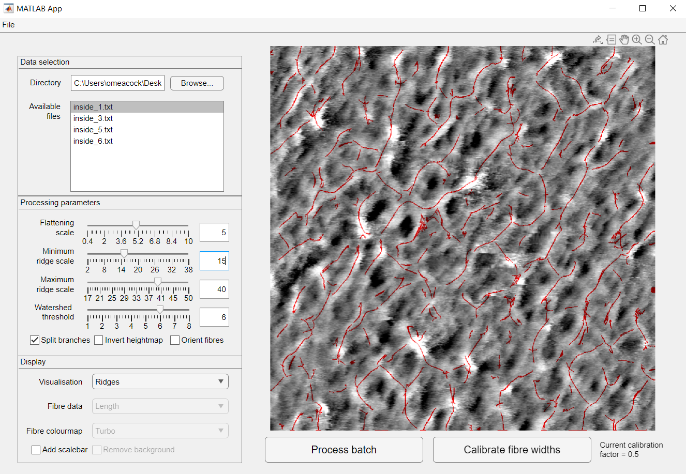
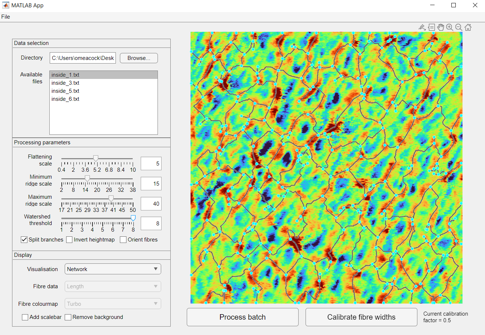
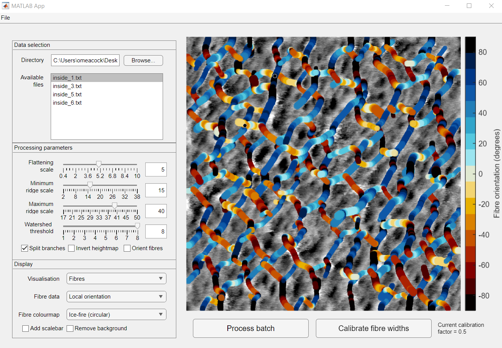
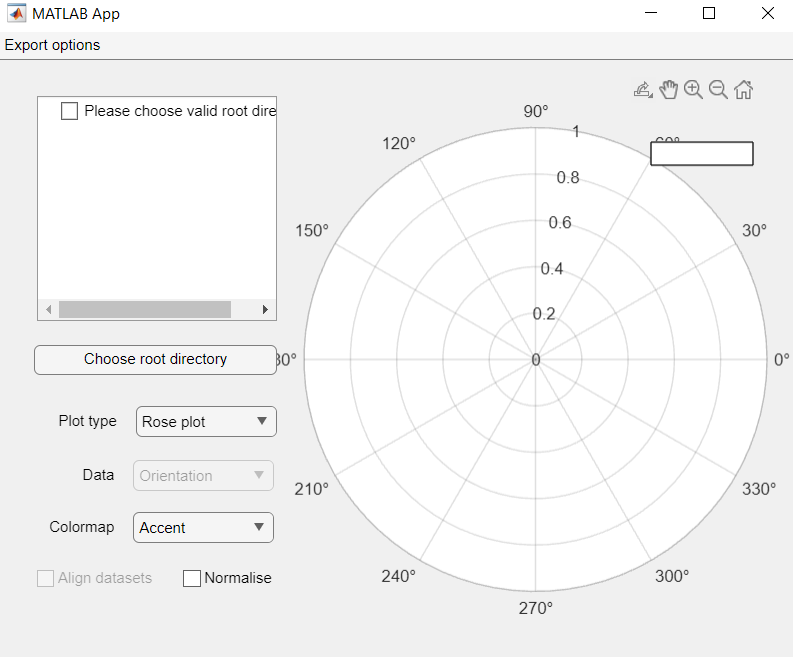
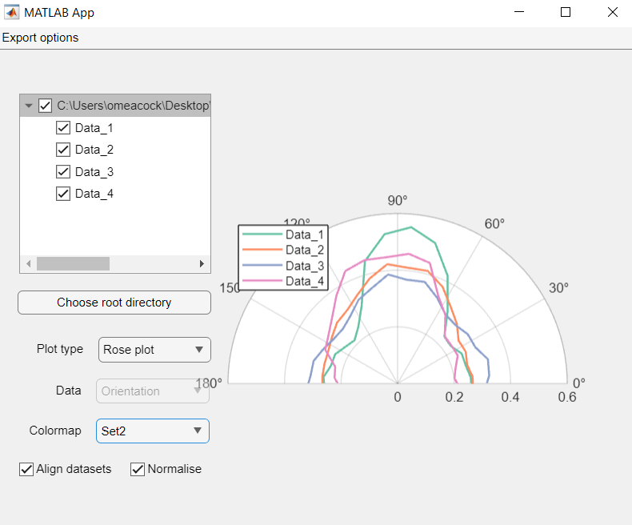
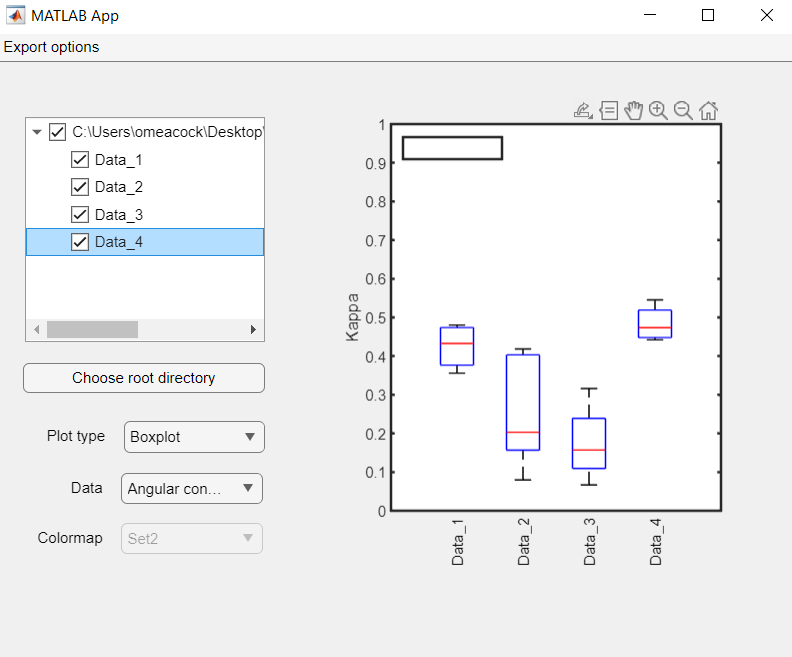

# fibreProps
Automated detection and measurement of peptidoglycan fibres in AFM images

## What you will need to do before beginning analysis:
1. **Exporting AFM data:**
2. **File structure:** fibreProps assumes that your AFM data is collected into directories that represent different conditions. 'Conditions' here refers to any set of experimental parameters that may be interesting to compare between such as different species identities, different drug treatments, different cell wall regions etc. Specifically, your data should be arranged as:
```
   Root/--Condition1/--Image1.txt
     |         |-------Image2.txt
     |         |-------Image3.txt
     |         :
     |
     |----Condition2/--Image1.txt
     |         |-------Image2.txt
     |         |-------Image3.txt
     |         :
     :
```
Note that '/Condition1/', 'Image1' etc. can be replaced with arbitrary, informative labels.

3. **Defining cell orientations:**
It is often useful to measure fibre orientations relative to some external angle, such as the long axis of the cell. fibrePlotter supports alignment of fibre orientation measurements to such external measurements, but must be told what they are. The `CellOrentations.csv` file is the means by which this data is provided to fibrePlotter. This file simply consists of Name,Value pairs which indicate the name of each image and the associated angle (in degrees, measured using standard polar coordinate conventions), respectively. A separate CellOrientations.csv file must be generated for each condition's directory.

Examples of the required AFM data format, file structure and `CellOrientations.csv` files are provided in the \example\ directory of this repository.

4. **Installation:** Both GUIs are implemented as Matlab Apps. To install, simply double-click on the relevant .mlappinstall file with Matlab open and follow the on-screen instructions. The app will then appear in the 'Apps' tab:
<p align="center">
  
</p>

## Detecting fibres: FibreFinder

FibreFinder is a Graphical User Interface (GUI) that automates detection and quantification of the peptidoglycan fibre network in a series of images associated with a single condition. Users select analysis parameters on a single image, and then apply these parameters to all images in the dataset with a built-in batch processing system.

Upon first opening FibreFinder, you will be greeted with an empty GUI:

<p align="center">
  
</p>

To load AFM data, click on the `Browse...` button and select one of the condition-level directories. .txt image files that match the expected format will now appear in the `Available files` window, with the top-most selected by default:

<p align="center">
  
</p>

After selecting the image you wish to optimise analysis parameters on, select the `Flattened` option in the `Visualisation` drop-down menu. You can now optimise the `Flattening scale` parameter, which removes large-scale fluctuations in the AFM data cause by, for example, undulations in the sample:

<p align="center">
  
</p>

Next, select the `Ridges` option in the `Visualisation` menu. The system will now automated scale-selection to find the best-fitting ridge to the fibres in the image, the centres of which will be drawn as red lines. Do not worry at this point if these do not entirely join together, as a watershed algorithm will be applied in the next step to bridge small gaps between ridges.

To modify the range of scales considered by the ridge detection algorithm, you can modify the `Minimum ridge scale` and `Maximum ridge scale` parameters.

<p align="center">
  
</p>

Selecting the `Network` option in the `Visualisation` menu will now bring up the reconstructed peptidoglycan network based on the detected ridges. The network is represented as a graph, with cyan dots indicating locations where fibres join together and dark lines indicating fibre bodies.

You can modify the stringency of the waterhsed algorithm (i.e. increase or reduce the distance two ridges must be to be joined together in the network) by modifying the `Watershed threshold` parameter. Higher values increase stringency and reduce the connectivity of the network.

<p align="center">
  
</p>

Finally, select the `Fibres` visualisation option to bring up an overlay of the final fibre network on top of the original image. Fibres in this image consist of joined edges from the graph-based network. 

Detected fibre-fibre crossing points are indicated with black circles, while the rendering of the fibres is selected with the `Fibre data` and `Fibre colourmap` dropdown menus. Note that the `Local orientation` rendering option typically takes several minutes to process.

<p align="center">
  
</p>

Additional functionality is provided by the checkboxes in different parts of the GUI.
In the `Processing parameters` window:
  - `Split branches`: Determines whether automatically-detected fibres with branchpoints should be split at these branch points. Set `on` by default.
  - `Invert heightmap`: Allows the underlying image data to be inverted before being inserted into the processing pipeline. Set `off` by default.
  - `Orient fibres`: If a properly-formatted `CellOrientations.csv` file is defined in this directory, allows the orientations of fibres to be measured relative to the externally-set orientation provided by the user. Set `off` by default.
In the `Display` window:
  - `Add scalebar`: Allows addition of an annotated scalebar to the current rendering. Set `off` by default.
  - `Remove background`: Allows the underlying image to be removed from the rendering of the `Fibres` visualisation. Useful for making fibres stand out in this image. Set `off` by default.

Once you're happy with the processing settings, press `Process batch` to apply identical analyses to all images in the current directory. This will generate the `foundFibres.mat` file upon termination, which contains the quantified fibre features for each of the images in the directory.

## Plotting fibres: FibrePlotter

FibrePlotter is a separate GUI that enables rapid statistical and visual comparisons between multiple conditions and images. Upon opening the app, you will be greeted with an empty GUI: 

<p align="center">
  
</p>

First, select the root-level directory you wish to visualise. Condition-specific sub-directories will now appear in the data selection window, which can be chosen using the checkboxes to add their data to the current plot. Note that _all_ condition-specific sub-directories that you wish to include in plotting must have been separately analysed with fibreFinder in order for them to appear in the data selection window.

FibrePlotter supports comparisons of images within a given condition as well as comparisons between conditions. Which of these two modes is currently active depends on the checkboxes that are currently selected in the data selection window. When condition-level subdirectories are checked comparisons will occur between conditions, whereas selection of individual images within a sub-directory will switch the system to the within-condition comparisons. For roseplots, orientational data is pooled between sub-images to perform between-condition comparisons.

Note that the boxplot plotting option only supports comparisons between conditions, while the histogram option only supports within-image comparisons.

To compare orientational data, select the `Rose plot` option in the `Plot type` dropdown menu:

<p align="center">
  
</p>

Plot appearance can be customised using the `Colormap` dropdown menu. The `Align datasets` checkbox allows the external orientation data supplied in `CellOrientations.csv` to be applied, allowing e.g. measurement of fibre orientations relative to the long axis of the cell. The `Normalise` checkbox can be selected to plot each distribution as a PDF rather than as raw counts.

To compare fibre length, width or the tightness of orientational distributions between conditions, select the `Boxplot` option:

<p align="center">
  
</p>

The specific data field plotted can then be selected using the `Data` dropdown menu.

## References

- Lindeberg, T. Edge Detection and Ridge Detection with Automatic Scale Selection (1998). _International Journal of Computer Vision_ **30** (2) 117-156 DOI: 10.1023/A:1008097225773
